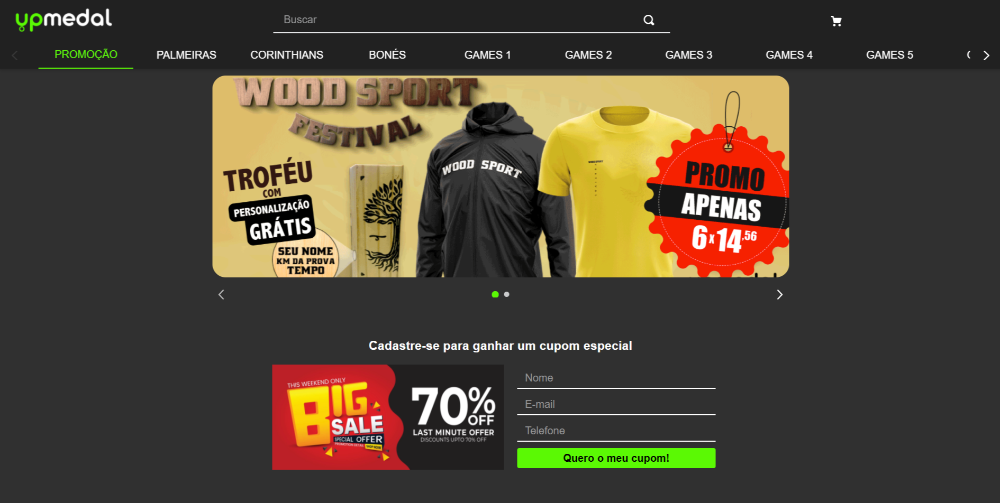

## #3 Desafio Hiring Coders #2

<b>Desafio</b> - Criar um E-commerce para o cliente UPMedal.com.

## Sobre o projeto
Esse desafio foi muito legal e difícil, meio confuso com o VTEX IO e não consegui fazer tudo o que foi solicidado, mas tentei até onde consegui.

Tive alguns problemas com css e acabei usando import, além de faltar o component fixed, acredito que seria possível melhorar a performance, otimizar as imagens e corrigir alguns "important" no css.

Crie a API na AWS, mas tive problemas com o Cors e não conseguir resolver a tempo

## Para ver/testar, acesse

[Kaya Store](https://ogma--hiringcoders2021.myvtex.com/)

## Tecnologias**

 
  
  
   
  

